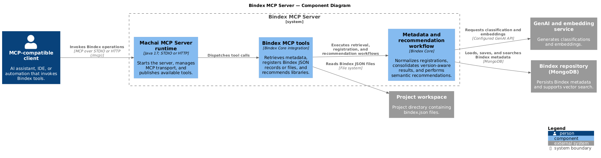

<!-- @guidance:
Generate or update the content as follows.  
**Important:** If any section or content already exists, update it with the latest and most accurate information instead of duplicating or skipping it.
# Page Structure: 
1. Header
   - [](https://sourceforge.net/projects/machanism/files/machai/bindex-mcp-server/releases/)
   - Project Title: need to use from pom.xml  
2. Overview
   - Review the relatad web page: `https://machai.machanism.org/bindex-core/index.html` (selector: #bodyColumn).
   - Review the relatad web page: `https://machai.machanism.org/mcp-server-maven-plugin/index.html` (selector: #bodyColumn).
   - Full description of purpose and benefits.
   - Use: src/site/resources/images/c4-diagram.png
3. Download Page
   - url: `https://sourceforge.net/projects/machanism/files/machai/bindex-mcp-server/releases/`.
3. Usage
   - Jar file can be used as a STDIO or HTTP MCP server, `how to use` information: `https://machai.machanism.org/machai-mcp-server/index.html#CLI`. 
4. Key Features
   - Bulleted list highlighting the primary capabilities of the project.
5. Getting Started
   - Prerequisites: List of required software and services.
   - Basic Usage: Example command to run the plugin.
   - Typical Workflow: Step-by-step outline of how to use the project artifacts.
6. Resources
   - List of relevant links (platform, GitHub, Maven).
-->

[](https://sourceforge.net/projects/machanism/files/machai/bindex-mcp-server/releases/)

# Bindex MCP Server

## Overview

Bindex MCP Server makes the library-discovery capabilities of **Bindex Core** available to any [Model Context Protocol (MCP)](https://modelcontextprotocol.io/) client. It packages Bindex metadata retrieval, validation and registration, and natural-language library recommendations behind a standard MCP interface, so AI assistants and automation clients can find reusable libraries before implementing a solution rather than recreating capabilities or selecting dependencies blindly.

Bindex records describe a library’s coordinates, version, purpose, classification, integrations, dependencies, examples, and configuration. Bindex Core validates and stores these descriptors, creates embeddings from their classifications, and combines semantic vector search with language, architectural-layer, score, and version filters. The server exposes that workflow through MCP tools: clients can recommend libraries for a request, inspect a full or field-filtered descriptor, register metadata from JSON, a project file, or a URL, and obtain Bindex schema and generation guidance.

The assembled application uses the Machai MCP Server runtime to discover and publish its functional tools. Run the same jar over local standard input/output (STDIO) for desktop-client integrations, or provide a port to expose an HTTP endpoint. This separates the MCP transport from Bindex’s metadata and search workflow, enabling repeatable local development, build automation, and remote tool access without a custom client integration.



## Download

Download a packaged release jar from [SourceForge: Bindex MCP Server releases](https://sourceforge.net/projects/machanism/files/machai/bindex-mcp-server/releases/).

## Usage

The release artifact is a runnable jar with its dependencies. Without `--port`, it starts as a STDIO MCP server; use this mode for clients such as Claude Desktop that launch the server as a subprocess. Supplying `--port` starts an HTTP MCP server. Add `--session` with HTTP mode when the client requires streamable, session-aware transport; otherwise the HTTP server uses stateless transport.

```powershell
# STDIO MCP server
java -jar .\bindex-mcp-server-<version>.jar

# Stateless HTTP MCP server
java -jar .\bindex-mcp-server-<version>.jar --port 45000

# Streamable HTTP MCP server with an explicit project directory and configuration file
java -jar .\bindex-mcp-server-<version>.jar --projectDir C:\path\to\project --config C:\path\to\mcp.properties --port 45000 --session
```

For HTTP mode, MCP clients connect to the server’s MCP endpoint, typically `http://localhost:45000/mcp`. The underlying runtime also supports `--name` and `--version` to set the metadata reported to MCP clients. See the [Machai MCP Server CLI guide](https://machai.machanism.org/machai-mcp-server/index.html#CLI) for all command-line options and client configuration examples.

## Key Features

- Publishes Bindex Core’s library discovery, descriptor retrieval, metadata registration, schema, and generation-prompt operations as MCP tools.
- Recommends reusable libraries from natural-language requests using configurable GenAI classification and embedding providers.
- Searches MongoDB-backed Bindex metadata with semantic vectors, classification filters, similarity thresholds, and version selection.
- Retrieves descriptors by coordinates or URL, with optional GraphQL-style field selection to minimize returned data.
- Registers schema-compliant Bindex metadata from objects, project-relative JSON files, or remote URLs.
- Runs from one runnable jar as either a local STDIO server or an HTTP server with stateless or streamable transport.
- Carries its runtime dependencies in the assembled release artifact for straightforward distribution.

## Getting Started

### Prerequisites

- Java 17 or later.
- A downloaded Bindex MCP Server release jar, or Maven to build the project from source.
- An MCP-compatible client for STDIO or HTTP use.
- A reachable MongoDB Bindex repository and the corresponding `BINDEX_REPO_URL`, `BINDEX_USER`, and `BINDEX_PASSWORD` settings when repository authentication or a non-default connection is required.
- Configured GenAI and embedding providers, including any required credentials and model settings, to use natural-language recommendations.
- An available TCP port and network access for HTTP mode.

### Basic Usage

Start the downloaded jar in the transport required by your client:

```powershell
java -jar .\bindex-mcp-server-<version>.jar --port 45000
```

To build the artifact locally, run Maven and use the assembled jar produced by the project’s `install` lifecycle configuration:

```powershell
mvn clean install
```

Set `MACHANISM_PACK_DIR` to the desired writable package directory before building; the assembly is written under `machai\bindex-mcp-server\releases` in that directory.

### Typical Workflow

1. Download a release or build the project with Maven.
2. Configure the MongoDB repository, GenAI provider, embedding provider, and any credentials required by your environment.
3. Start the jar in STDIO mode for a local MCP client, or start it with `--port` for HTTP access.
4. Connect an MCP client and confirm that the Bindex tools are available.
5. Ask the client to recommend libraries for a development request; inspect the returned descriptors before selecting dependencies.
6. Register validated Bindex metadata for newly created or updated libraries so they are available for future discovery.

## Resources

- [Machai platform](https://machai.machanism.org/)
- [Bindex Core documentation](https://machai.machanism.org/bindex-core/index.html)
- [Machai MCP Server CLI documentation](https://machai.machanism.org/machai-mcp-server/index.html#CLI)
- [Bindex MCP Server releases](https://sourceforge.net/projects/machanism/files/machai/bindex-mcp-server/releases/)
- [Bindex MCP Server on GitHub](https://github.com/machanism-org/bindex-mcp-server)
- [Machai GitHub repository](https://github.com/machanism-org/machai)
- [Bindex Core on Maven Central](https://central.sonatype.com/artifact/org.machanism.machai/bindex-core)
- [Machai MCP Server on Maven Central](https://central.sonatype.com/artifact/org.machanism.machai/machai-mcp-server)
