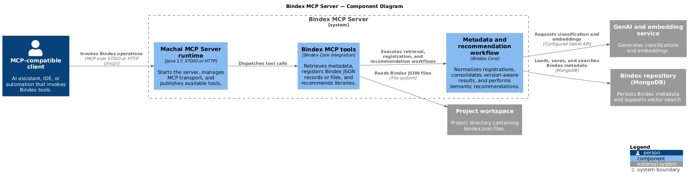

<!-- @guidance: >>> ${guidances}/readme-content.md 

# Additional Infomation
IMPORTANT: Do not add [Maven Central] shield to the page.

## Overview 
- Review the relatad web page: `https://machai.machanism.org/bindex-core/index.html` (selector: #bodyColumn).
- Review the relatad web page: `https://machai.machanism.org/mcp-server-maven-plugin/index.html` (selector: #bodyColumn).
- Full description of purpose and benefits.
   
## Download Page
- url: `https://sourceforge.net/projects/machanism/files/machai/bindex-mcp-server/releases/`.

## Usage
- Jar file can be used as a STDIO or HTTP MCP server, `how to use` information: `https://machai.machanism.org/machai-mcp-server/index.html#CLI`. 

## Key Features
- Bulleted list highlighting the primary capabilities of the project.

## Getting Started
- Prerequisites: List of required software and services.
- Basic Usage: Example command to run the plugin.
- Typical Workflow: Step-by-step outline of how to use the project artifacts.
-->

# Bindex MCP Server

[](https://raw.githubusercontent.com/machanism-org/bindex-mcp-server/refs/heads/main/bindex.json)

Bindex MCP Server packages Bindex Core with the Machai MCP runtime to provide metadata registration, retrieval, and natural-language library recommendations over STDIO or HTTP.

## Cloning and Getting Started

To clone and set up this project locally, follow these steps:

1. **Clone the repository:**
   ```bash
   git clone https://github.com/machanism-org/bindex-mcp-server.git
   cd bindex-mcp-server
   ```
2. **Build the project using Maven:**
   ```bash
   mvn clean install
   ```

## Overview

Bindex MCP Server is a Java 17 distribution that combines [Bindex Core](https://machai.machanism.org/bindex-core/index.html) with the [Machai MCP Server](https://machai.machanism.org/machai-mcp-server/index.html). It exposes Bindex metadata retrieval, registration, and natural-language library recommendations as Model Context Protocol (MCP) tools for AI assistants, IDEs, and automation clients.

Bindex records describe software libraries using structured coordinates, versions, purpose, classification, integrations, dependencies, examples, and configuration guidance. Through this server, clients can inspect complete or GraphQL-filtered descriptors, register metadata from JSON, project-relative files, or remote URLs, and find reusable libraries from a natural-language request. Bindex Core combines AI-generated classifications and embeddings with language, architectural-layer, similarity-score, and version-aware filtering over a MongoDB-backed repository. This improves dependency selection, makes reusable capabilities discoverable, and reduces duplicate implementation work.

The Machai MCP runtime handles tool discovery, request routing, and transport. The executable works locally over STDIO or remotely over stateless HTTP; streamable HTTP sessions are also available. For build-driven HTTP hosting, the related [MCP Server Maven Plugin](https://machai.machanism.org/mcp-server-maven-plugin/index.html) can start stateless or streamable MCP endpoints from a Maven project.

## Supported AI Providers

Bindex registration and semantic recommendations use Machai's GenAI provider abstraction. Model values use the `Provider:Model` form. Configure the generation or classification model through `gw.model` or `pick.model`, and select a compatible embedding model through `embedding.model`; embedding dimensions must match the MongoDB vector index.

- **OpenAI** — Use identifiers such as `OpenAI:gpt-4o-mini` for generation and `OpenAI:text-embedding-3-small` for embeddings. Set `OPENAI_API_KEY`; optionally set `OPENAI_BASE_URL` for an OpenAI-compatible endpoint.
- **Anthropic** — Use identifiers such as `Anthropic:claude-3-5-sonnet`. Set `ANTHROPIC_API_KEY`; optionally set `ANTHROPIC_BASE_URL`.
- **CodeMie** — Use identifiers such as `CodeMie:gpt-4o-mini`, `CodeMie:claude-3-5-sonnet`, or `CodeMie:text-embedding-005`. Set `GENAI_USERNAME` and `GENAI_PASSWORD`; optionally override the token endpoint with `AUTH_URL`.
- **Tools** — Use `Tools:yaml` to invoke registered local Java callbacks from a YAML tool-call descriptor; no external AI credentials are required.
- **None** — Use `None:disabled` for a silent no-op provider or `None:log` for lifecycle diagnostics, suitable for safe defaults and tests.

### Common Configuration Parameters

| Parameter | Description | Default value |
| --- | --- | --- |
| `gw.model` | GenAI model used for classification when `pick.model` is not set. | `CodeMie:gpt-5.6-terra-2026-07-09` |
| `pick.model` | Optional model specifically used to classify library-selection requests. | Falls back to `gw.model` |
| `embedding.model` | Provider and model used to create vectors for semantic search. | Host/application-defined |
| `OPENAI_API_KEY` / `ANTHROPIC_API_KEY` | Credentials for the selected direct provider. | Required for the selected provider |
| `GENAI_USERNAME`, `GENAI_PASSWORD` | Credentials used to authenticate with CodeMie. | Provider-specific |
| `AUTH_URL` | CodeMie OpenID Connect token endpoint override. | CodeMie default endpoint |
| `GENAI_TIMEOUT` | AI request timeout in seconds; `0` or unset uses SDK behavior. | `0` |
| `MAX_OUTPUT_TOKENS` | Maximum number of output tokens generated by a model. | `18000` |
| `MAX_TOOL_CALLS` | OpenAI Responses API tool-call limit; `0` leaves the limit unset. | `0` |
| `BINDEX_REPO_URL` | MongoDB URI for Bindex metadata storage and vector search. | `mongodb+srv://cluster0.hivfnpr.mongodb.net/?appName=Cluster0` |
| `BINDEX_USER`, `BINDEX_PASSWORD` | Optional MongoDB authentication credentials. | Not set |
| `score` / `pick.score` | Minimum semantic similarity accepted for recommendations. | `0.85` for the AI tool; `0.86` in built-in pick/assembly acts |
| `limits` / `vectorSearchLimits` | Maximum vector-search candidates or recommendations. | `25` |

## Key Features

- Publishes Bindex operations as standard MCP function tools.
- Recommends libraries using natural-language classification, embeddings, semantic search, and configurable relevance thresholds.
- Retrieves Bindex metadata by coordinates or URL with optional GraphQL-style field projection.
- Validates and registers schema-compliant metadata from JSON objects, local project files, and remote resources.
- Supports MongoDB persistence, vector search, classification filters, and version-aware result selection.
- Runs from one executable JAR over STDIO, stateless HTTP, or streamable HTTP.
- Uses configurable OpenAI, Anthropic, CodeMie, or compatible GenAI and embedding services through the Machai provider abstraction.

## Project Structure

The MCP-compatible client communicates with the Machai runtime over STDIO or HTTP. The runtime dispatches calls through the Bindex tool adapter to metadata and recommendation operations. Metadata operations read local or remote descriptors and persist validated records in MongoDB, while recommendation operations use configured GenAI and embedding services before searching the repository.



## Download Page

Prebuilt release artifacts are available from the [Bindex MCP Server download page](https://sourceforge.net/projects/machanism/files/machai/bindex-mcp-server/releases/).

## Getting Started

### Prerequisites

- Java 17 or newer.
- Apache Maven when building from source.
- A downloaded or locally built Bindex MCP Server JAR.
- MongoDB connectivity and credentials required by the configured Bindex repository.
- Credentials and model settings for the selected GenAI and embedding providers.
- An MCP-compatible client; HTTP mode additionally requires an available TCP port.

### Basic Usage

Run the assembled JAR over STDIO on Windows:

```powershell
java -jar "path\to\bindex-mcp-server.jar"
```

Start a stateless HTTP server on port `45000`:

```powershell
java -jar "path\to\bindex-mcp-server.jar" --port 45000
```

Alternatively, start a stateless HTTP endpoint from a Maven project with the related MCP Server Maven Plugin:

```powershell
mvn org.machanism.machai:mcp-server-maven-plugin:1.4.1:stateless -Dmcp.port=45000 -Dmcp.config=path\to\mcp.properties
```

Add `--session` to the HTTP command for streamable transport. Additional options such as `--projectDir`, `--config`, `--name`, and `--version` configure the runtime. See the [Machai MCP Server CLI guide](https://machai.machanism.org/machai-mcp-server/index.html#CLI) for complete command-line and client configuration details.

### Typical Workflow

1. Download a release artifact or clone and build the project.
2. Configure MongoDB access, a generation/classification model, and a compatible embedding model.
3. Start the JAR in STDIO mode for a local process integration, or use `--port` for HTTP access.
4. Configure the MCP client to launch the process or connect to `http://localhost:45000/mcp`.
5. Confirm that the Bindex retrieval, registration, and recommendation tools are available.
6. Register or inspect descriptors, then request library recommendations from the client.

## Usage

The main AI-facing operations are:

- `get_bindex` — retrieve a descriptor and optionally limit its fields with a GraphQL-style selection.
- `pick_libraries` — recommend libraries relevant to a natural-language development request.
- `register_bindex` — register metadata from a project-relative file or remote URL.
- `register_bindex_json` — validate and register a Bindex JSON object directly.

A typical client first uses `pick_libraries` during planning, inspects selected descriptors with `get_bindex`, and applies their installation and configuration guidance during implementation. Library maintainers can validate and publish updated descriptors with either registration tool.

## Resources

- [Bindex MCP Server releases](https://sourceforge.net/projects/machanism/files/machai/bindex-mcp-server/releases/)
- [Bindex Core documentation](https://machai.machanism.org/bindex-core/index.html)
- [Machai MCP Server CLI guide](https://machai.machanism.org/machai-mcp-server/index.html#CLI)
- [MCP Server Maven Plugin documentation](https://machai.machanism.org/mcp-server-maven-plugin/index.html)
- [Bindex MCP Server on Maven Central](https://central.sonatype.com/artifact/org.machanism.machai/bindex-mcp-server)
- [Machai platform](https://machai.machanism.org/)
- [Source repository](https://github.com/machanism-org/bindex-mcp-server)
